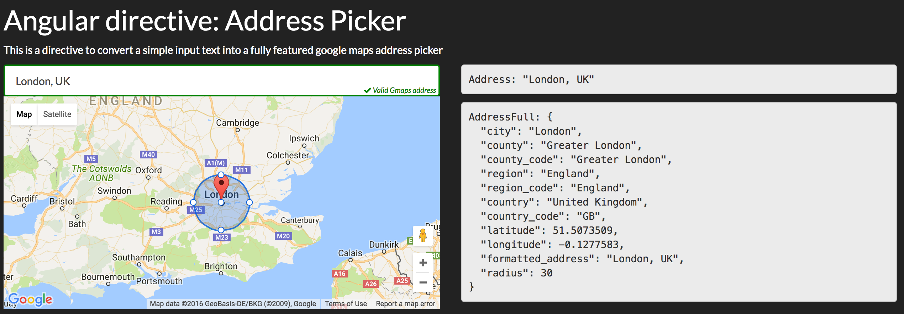

# Angular directive: wb-google-addresspicker

[](https://github.com/WuglyakBolgoink/wb-google-addresspicker/blob/master/LICENSE)

[](https://nodei.co/npm/wb-google-addresspicker/)

---

## Description

This is a directive for [angular](https://github.com/angular/angular.js) (based on [jQuery Address Picker](https://github.com/bygiro/jQuery-AddressPicker-ByGiro) project).
It will convert a simple input text into a fully featured google maps address picker with typeahead.



---

## Install with NPM

```bash
npm install wb-google-addresspicker --save
```

## Install with Bower

```bash
bower install wb-google-addresspicker --save
```

## HOW TO

### Dependencies

1. jQuery
2. [jquery-addresspicker](https://github.com/bygiro/jquery-addressPicker-ByGiro)
3. API_KEY for Google Maps
 
    ```
    http://maps.google.com/maps/api/js?key=<MY_API_KEY>&language=en
    ```

### Options (see [jquery-addresspicker](https://github.com/bygiro/jquery-addressPicker-ByGiro))

```js
{
  appendAddressString: "",
  draggableMarker: true,
  regionBias: null,
  bounds: '',
  componentsFilter:'',
  updateCallback: null,
  reverseGeocode: false,
  autocomplete: 'default',
  mapOptions: {
      zoom: 5,
      center: new google.maps.LatLng(46, 2),
      scrollwheel: false,
      mapTypeId: google.maps.MapTypeId.ROADMAP
  },
  elements: {
      map: false,
      lat: false,
      lng: false,
      street_number: false,
      route: false,
      locality: false,
      administrative_area_level_3: false,
      administrative_area_level_2: false,
      administrative_area_level_1: false,
      country: false,
      postal_code: false,
      type: false
  },
  autocomplete: '' // could be autocomplete: "bootstrap" to use bootstrap typeahead autocomplete instead of jQueryUI
}
```


### Demo

```html
<div class="row">
        <div class="col-md-6">
            <p>
                <input class="form-control"
                       type="text"
                       autocomplete="off"
                       data-ng-model="ctrl.address"
                       data-gap-model="ctrl.addressFull"
                       data-gap-options="ctrl.addressPickerOptions"
                       data-wb-google-addresspicker>
            </p>
        </div>
        <div class="col-md-6">
                <pre>Address: {{ctrl.address | json}}</pre>
            <p>
                <pre>AddressFull: {{ctrl.addressFull | json}}</pre>
            </p>
        </div>
    </div>
```

> Add angular module `'WB.GAddressPicker'` as dependency in your app
 
```js
(function() {
    'use strict';

    angular
        .module('demoApp', [
            'WB.GAddressPicker'
        ])
        .controller('demoCtrl', DemoController);

    function DemoController() {
        var ctrl = this;

        ctrl.address = '';
        ctrl.addressFull = null;

        ctrl.addressPickerOptions = {
            distanceWidget: true,
            addressComponents: true,
            elements: {
                map: true,
                lat: true,
                lng: true,
                street_number: true,
                route: true,
                locality: true,
                administrative_area_level_3: true,
                administrative_area_level_2: true,
                administrative_area_level_1: true,
                country: true,
                postal_code: true,
                type: true
            }
        };
    }
})();
```

---

## Notes

- This is fork from `bygiro/Angular-Address-Picker`.


---


## License

[MIT](https://github.com/WuglyakBolgoink/wb-google-addresspicker/blob/master/LICENSE)

